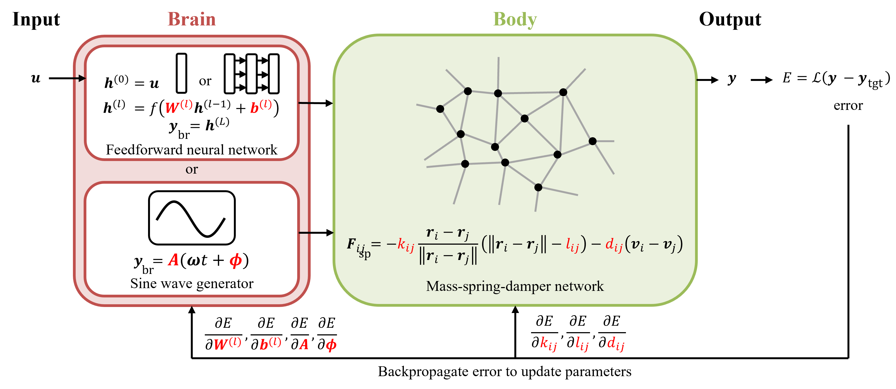

# Backpropagation through Soft Body

## Overview
This repository provides tools for simulation and optimization of the brain--body coupling systems.
The brain is modeled as a feed-forward neural network (FNN) or a sine wave generator (SWG).
On the other hand, the body is modeled as a mass-spring-damer network (MSDN) to simulate a soft mechanical system.
The simultaneous optimization method is called "backpropagation through soft body (BPTSB)" because physical simulation is performed while retaining gradients consistently throughout the whole brain–body system.
This tool allows you to conduct tasks including classification and corresponding behavioral association, nonlinear dynamical system emulation, and autonomous behavioral generation.



## Environment
The code has been tested on the following environment:
- Host OS: Windows 11
- WSL Version: WSL 2
- WSL Distribution: Ubuntu 24.04
- Python: 3.10.4

## Installation
The installation process takes approximately less than 5 minutes.
```
git clone https://github.com/hiroki-tomioka/BPTSB.git
cd BPTSB
conda env create -f environment.yaml
conda activate bptsb
```

## Usage
- General usage
```
cd BPTSB
python run.py --config <config file path> [--seed <random seed>] [--gpu <gpu>] [--load <file path>] [--load_file_suffix <suffix>] [--memo <memo>]
```
- MNIST (classification and corresponding behavioral association)
    - Training
        - The system input is an MNIST image, and the system output is the trajectory of the central mass point of the MSDN, where the aim is to draw the corresponding number with it. An MNIST image is input to the brain, followed by a transformation into the initial positions of the movable mass points. The mass points are released from their initial positions at rest at time t = 0, and motions are then generated through transient dynamics. Regarding the trajectory of the central mass point as the output, the system is trained to draw the shape of the input label’s number.
        - The trajectories dataset is currently unavailable.
        - ex. `python run.py --config config/MNIST/training.yaml --seed 0`
        - Expected run time: 70 min/epoch (on CPU)
        - Expected outputs:
            - agent_{# of training}.pickle / simulenv_*.pickle: Objects
            - position.npz / centerNode_{label}-{sample}.png: Drawn trajectories
            - movie_{label}-{sample}.gif: Behaviors of the system
            - target_{label}-{sample}.png: Input images
            - params_change.npz / params_change_{variable}.png: Parameter histories
            - loss.npy / loss.png: Loss history
            - params.json: Setting parameters
    - Label map
        - It analyzes the effect on the trajectory of the CMP of changes in the initial positions of the noncentral mass points. Label maps are created in which the displacements of the noncentral mass points were charted on x-y axes, which analyze the effect on the trajectory of the central mass point of changes in the initial positions of the noncentral mass points. Their colors correspond to the numbers to which the trajectory shapes of the central mass point are most similar.
        - ex. `python run.py --config config/MNIST/labelmap.yaml --seed 0 --load results/MNIST/physicalOutput/MLP_DoubleCircles/2025-01-01_shapeDoubleCircles_nodes33_batch500_tau10_fixedImages-1_seed0_char-1/ --load_file_suffix final`
        - Expected run time: 80 min (on CPU)
        - Expected outputs:
            - labelmap_num{label}_node{nodeID}.png / labelmap_num{label}_node{nodeID}.npz: Label maps
            - params.json: Setting parameters
    - PCA
        - To determine the division of roles between brain and body, we focused on the outputs of each component. The former corresponds to the initial positions of the mass points, and the latter corresponds to the trajectory of the central mass point. We verified this by compressing these outputs into two dimensions using principal component analysis (PCA).
        - ex. `python run.py --config config/MNIST/PCA.yaml --seed 0 --load results/MNIST/physicalOutput/MLP_DoubleCircles/2025-01-01_shapeDoubleCircles_nodes33_batch500_tau10_fixedImages-1_seed0_char-1/ --load_file_suffix final`
        - Expected run time: 30 min (on CPU)
        - Expected outputs:
            - allData_for_pca.pickle
            - PCA_test_initPosData.pickle
            - PCA_testData_initPos_*: PCA results of the initial mass point positions (the output of the brain)
            - PCA_testData_traj_*: PCA results of the trajectory (the output of the body)
            - PCA_*_contribution_ratio.npy: Contribution ratio of PCA
            - centerNode_best_{label}.png: Drawn trajectories (best sample)
            - best_position_test.npz: Mass point positions of the best samples
            - errors*.npy: Trajectories errors
            - params.json: Setting parameters
- Timeseries emulation (nonlinear dynamical system emulation)
    - Training (expanded NARMA)
        - A system receives input timeseries and generates output time-series to emulate the target. With reference to the nonlinear autoregressive moving average (NARMA), we prepared expanded NARMA as target output time-series. The input is converted to external forces in the brain to act on the movable mass points. The body generated the dynamics, and the y-coordinate position of the central mass point is designated as the output.
        - ex. `python run.py --config config/timeseries/expandedNARMA.yaml --seed 0`
        - Expected run time: 50 min/100epochs (on CPU)
        - Expected outputs:
            - agent_{# of training}.pickle / simulenv_*.pickle: Objects
            - trainANDtest.png / test.png: Output time-series
            - input_target_prediction.npz: Time-series
            - movie_*.gif: Behaviors of the system
            - inputSize_tau_inputScale.npy
            - params_change.npz / params_change_{variable}.png: Parameter histories
            - loss*: Loss
            - params.json: Setting parameters
    - Training (memory task)
        - The rough experimental settings are the same as expanded NARMA, but the system has to reproduce the past input as is.
        - ex. `python run.py --config config/timeseries/memory.yaml --seed 0`
        - Expected run time: 50 min/100epochs (on CPU)
        - Expected outputs:
            - agent_{# of training}.pickle / simulenv_*.pickle: Objects
            - trainANDtest.png / test.png: Output time-series
            - input_target_prediction.npz: Time-series
            - movie_*.gif: Behaviors of the system
            - inputSize_tau_inputScale.npy
            - params_change.npz / params_change_{variable}.png: Parameter histories
            - loss*: Loss
            - params.json: Setting parameters
    - Information processing capacity (IPC)
        - Currently unavailable
- Lissajous (autonomous behavioral generation)
    - Training <!--(drawing single curve)-->
        - A system is trained so that the central mass point draw a Lissajous curve; this task embeds a limit cycle into the brain–body coupling system. The springs are modulated by sine wave generators.
        - ex. `python run.py --config config/Lissajous/training_single.yaml --seed 0`
        - Expected run time: 20 min/2000simTime (on CPU)
        - Expected outputs:
            - agent_{# of training}.pickle / simulenv_*.pickle: Objects
            - trajectoriy*: Trajectories
            - movie_*.gif: Behaviors of the system
            - params_change.npz / params_change_{variable}.png: Parameter histories
            - loss*: Loss
            - params.json: Setting parameters
    <!--
    - Training (switching 2 curves)
        - This experiment also involves behavior switching according to an external input by embedding plural curves into the system. For a physical-system-specific conditioning, we defined blowing "wind" as the external inputs. When "wind" is blowing, the system draws one curve, and when "wind" is not blowing, it draws another curve.
        - ex. `python run.py --config config/Lissajous/training_switching.yaml --seed 0 --load results/Lissajous/1-2-0-1/2025-01-01_shapeDoubleCircles_nodes25_updateTimeScale100_seed0_all/ --load_file_suffix final`
    -->
    - Closed loop
        - A system composed of an SWG and an MSDN is trained for an objective behavior by BPTSB. The weights of a feedback layer are calculated via ridge regression based on the error between the output of the SWG and that of the feedback layer. A closed loop is formed by replacing control signals with feedback signals.
        - ex. `python run.py --config config/Lissajous/closedloop.yaml --seed 0 --load results/Lissajous/1-2-0-1/2025-01-01_shapeDoubleCircles_nodes25_updateTimeScale100_seed0_all/ --load_file_suffix final`
        - Expected run time: 4 min (on CPU)
        - Expected outputs:
            - agent_{# of training}.pickle / simulenv_*.pickle: Objects
            - trajectoriy*: Trajectories
            - movie_*.gif: Behaviors of the system (-1: open-loop / 0: closed-loop)
            - dynamics*: Dynamics of the system (-1: open-loop / 0: closed-loop)
            - loss*: Loss
            - params.json: Setting parameters
    - Perturbation
        - After applying perturbations to the positions of the movable mass points, we checked whether the system returned to the desired behavior. A noise with a normal distribution (mean zero) was provided as the perturbation.
        - ex. `python run.py --config config/Lissajous/perturbation.yaml --seed 0 --load results/Lissajous/1-2-0-1/2025-01-01_shapeDoubleCircles_nodes25_updateTimeScale100_seed0_all/closedloop/2025-01-01_final_all_noise0.08/ --load_file_suffix final`
        - Expected run time: 90 min/10seeds (on CPU)
        - Expected outputs:
            - return_rate.npy / return_rate.png: Return rate
            - successful_trajectory_*.png: Trajectory which successfully returned to the original
            - failed_trajectory_*.png: Trajectory which did not return to the original
            - target_losses_centralPositions.npz
            - clustered_losses_*.npy: Clustering result based on the loss
            - params.json: Setting parameters
    <!--
    - Switching dynamics analysis
        - We can analyze the obtained switching behaviors when the external input value for the system is unknown while training.
        - ex. `python run.py --config config/Lissajous/switching_dynamics.yaml --seed 0 --load results/Lissajous/1-2-0-1/2024-12-27_shapeDoubleCircles_nodes25_updateTimeScale100_seed0_all/additionalTraining/2024-12-27_final/ --load_file_suffix final`
    -->
- Locomotion (autonomous behavioral generation)
    - Training <!--(forward locomotion without "wind")-->
        - A system is trained so that the agent moves forward. The springs are modulated by sine wave generators.
        - ex. `python run.py --config config/locomotion/training_forward.yaml --seed 0`
        - Expected run time: 15 min/1000simTime (on CPU)
        - Expected outputs:
            - agent_{# of training}.pickle / simulenv_*.pickle: Objects
            - speed*: Speed
            - movie_*.gif: Behaviors of the system
            - params_change.npz / params_change_{variable}.png: Parameter histories
            - loss*: Loss
            - params.json: Setting parameters
    <!--
    - Training (switching locomotion)
        - In this experiment, locomotion is required to switch according to the “wind.” In particular, the agent has to keep a constant locomotion speed whether a headwind is blowing or not.
        - ex. `python run.py --config config/locomotion/training_switching.yaml --seed 0 --load results/locomotion/2024-12-29_shapeCaterpillarRobot_nodes10_updateTimeScale200_seed0_forward/ --load_file_suffix final`
    -->
    - Closed loop
        - A system composed of an SWG and an MSDN is trained for an objective behavior by BPTSB. The weights of a feedback layer are calculated via ridge regression based on the error between the output of the SWG and that of the feedback layer. A closed loop is formed by replacing control signals with feedback signals.
        - ex. `python run.py --config config/locomotion/closedloop.yaml --seed 0 --load results/locomotion/2024-12-29_shapeCaterpillarRobot_nodes10_updateTimeScale200_seed0_forward/ --load_file_suffix final`
        - Expected run time: 4 min (on CPU)
        - Expected outputs:
            - agent_{# of training}.pickle / simulenv_*.pickle: Objects
            - speed*: Speed
            - movie_*.gif: Behaviors of the system (-1: open-loop / 0: closed-loop)
            - dynamics*: Dynamics of the system (-1: open-loop / 0: closed-loop)
            - loss*: Loss
            - springLength.npy: Spring lengths
            - params.json: Setting parameters
    - Perturbation
        - After applying perturbations to the positions of the movable mass points, we checked whether the system returned to the desired behavior. A noise with a normal distribution (mean zero) was provided as the perturbation.
        - ex. `python run.py --config config/locomotion/perturbation.yaml --seed 0 --load results/locomotion/2024-12-29_shapeCaterpillarRobot_nodes10_updateTimeScale200_seed0_forward/closedloop/2024-12-29_final_all_noise0.2/ --load_file_suffix final`
        - Expected run time: 30 min/10seeds (on CPU)
        - Expected outputs:
            - return_rate.npy / return_rate.png: Return rate
            - losses_speed.npz
            - params.json: Setting parameters
    <!--
    - Switching dynamics analysis
        - We can analyze the obtained switching behaviors when the external input value for the system is unknown while training.
        - ex. `python run.py --config config/locomotion/switching_dynamics.yaml --seed 0 --load results/locomotion/2024-12-29_shapeCaterpillarRobot_nodes10_updateTimeScale200_seed0_forward/additionalTraining/2024-12-29_final_wind/ --load_file_suffix final`
    -->

## References
[SpringMassNetworks](https://github.com/gurbain/SpringMassNetworks/tree/master/roboTraining)